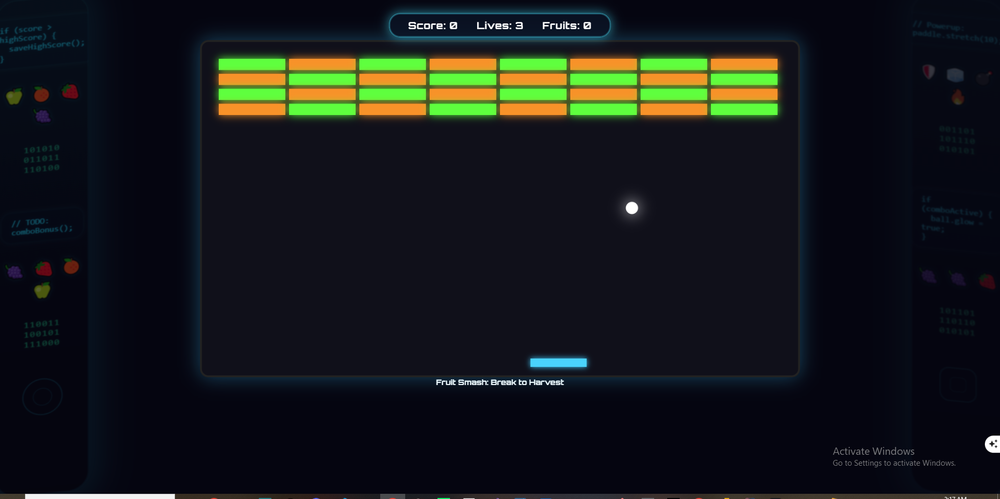
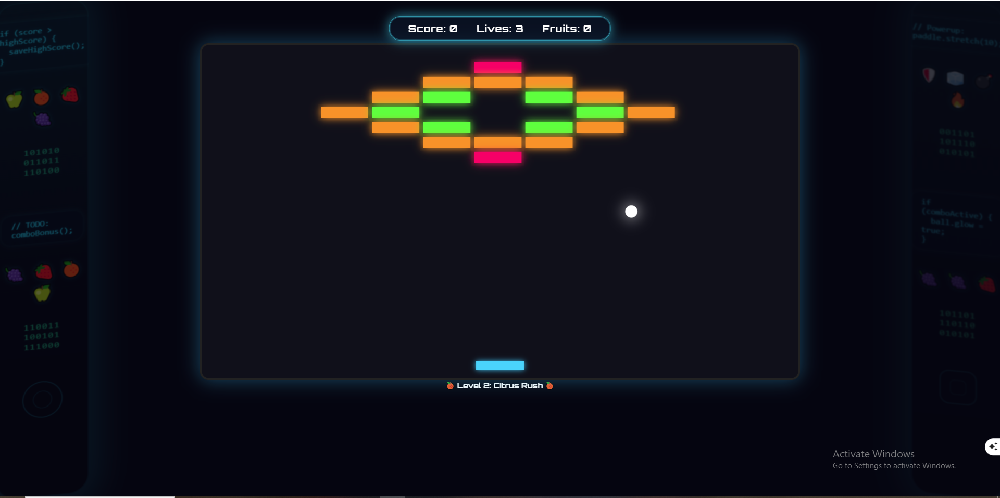
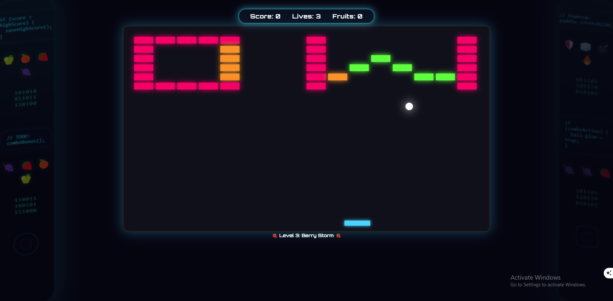
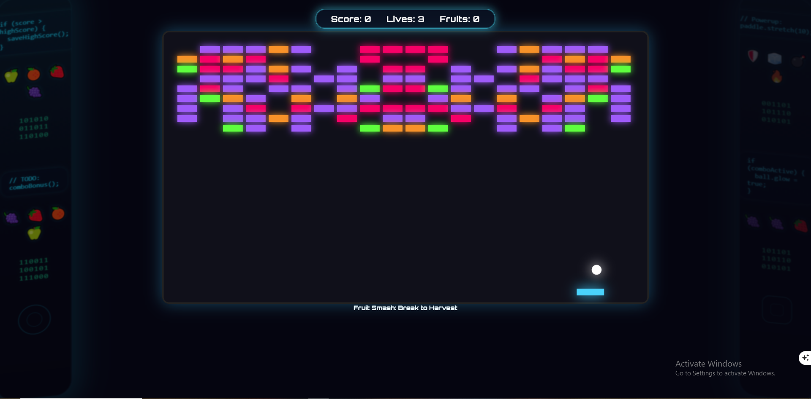
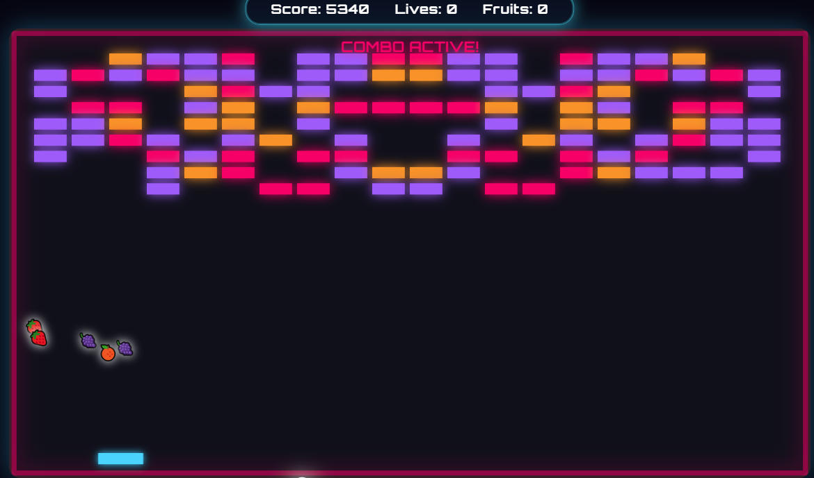

# BRICK BREAKER: CODE SMASH

A cyberpunk, AAA-quality, fully modular Brick Breaker game built with HTML, CSS, and vanilla JavaScript. Featuring a futuristic main menu, dynamic levels, combos, powerups, and a visually stunning UI/UX inspired by retro-futurism and hacking terminals.

---

## 🚀 Game Overview

**BRICK BREAKER: CODE SMASH** is a feature-rich, modern take on the classic brick breaker genre. It combines:

* A glassmorphic, neon-lit main menu with animated canvases and interactive modals
* Four unique, hand-crafted levels with increasing difficulty and visual identity
* Combos, fruit powerups, and boss mechanics designed for tactical depth
* A responsive, accessible, visually immersive design tailored for desktop and mobile

Each level introduces new game logic and challenges, leading to an intense and satisfying arcade experience — all built with **pure web technology** and an optimized JavaScript architecture.

---

## 🖼️ Screenshots

| Section          | Screenshot Link                                         |
| ---------------- | ------------------------------------------------------- |
| Main Menu        |                |
| Levels Modal     |                |
| Instructions     |    |
| Settings         |            |
| Level 1          |                     |
| Level 2          |                     |
| Level 3          |                     |
| Level 4          |                     |
| Fruit Generation          |                        |

---

## 🎮 Features

### ✨ Main Menu System

* **Fully animated canvas background** with floating particles and matrix trails
* **Glassmorphism UI** styled with neon-blue borders and dark translucent containers
* ARIA-compliant and keyboard-navigable for full accessibility
* Transitions between menu panels and game states use **smooth CSS animations**

### 🧱 Dynamic Levels

Each level is more than just visual — it modifies gameplay logic:

* **Level 1** – Beginner friendly: wide paddle, slower ball, basic brick grid
* **Level 2** – Hollow diamond layout: tighter paddle, faster ball, color-based fruit logic
* **Level 3** – Hollow “D” and “W” shaped bricks: combo system is introduced, ball accelerates
* **Level 4** – Final boss: bricks regenerate, obstacles mirror, powerups rain down

### 🔗 Combo Mechanics

* Break **3 same-colored bricks within 6 seconds** to trigger:

  * Bonus score
  * Ball glow effect
  * Paddle border FX
  * Special sound and UI feedback
* Designed to reward speed and color-targeting strategy

### 🍓 Fruit & Powerups

* Every destroyed brick has a chance to **drop a fruit** (with optional animation trail)
* Fruit types depend on the brick’s color
* Examples:

  * 🍌 Banana: Stretch paddle
  * 🍒 Cherry: Speed boost
  * 🫐 Blueberry: Freeze bricks
  * 🍇 Grape: Multiball
* Fruits animate toward the paddle and apply effects on catch
* Level 4 introduces **fruit storms and powerup chaining**

### 🧩 Modularity & UI Overlays

* Fully modular modal system:

  * **Levels Modal** — Jump to any unlocked level
  * **Instructions Modal** — Dynamic scrollable panel explaining game systems
  * **Settings Modal** — Toggle music/sfx, set difficulty, adjust paddle sensitivity
  * **Credits Modal** — Links to author and GitHub repo
* All panels use **z-index layers** and **CSS fade/slide transitions**

### ⚙️ Accessibility & Responsiveness

* Works across desktop, mobile, and tablet resolutions
* Buttons and modals are ARIA-labeled and `tabindex` enabled
* Game elements resize dynamically based on window width and aspect ratio

### 🖌️ AAA Visual Polish

* Glass panels with **backdrop-filter blur**
* **Neon-glow shadows** for text and buttons
* Particle and matrix animation overlays
* Modular HUD with glowing scoreboard and combo tracker
* Animated fruit icons and powerup notifications

---

## 🛠️ How the Game Was Made

This game was built using a series of detailed, AAA-level prompts, each focusing on a different aspect of modern game development:

* **Main Menu:** Designed as a cyberpunk, glassmorphic UI with animated canvas background, neon title, and interactive modals for levels, instructions, settings, and credits. All menu logic is modular and accessible.
* **Levels:** Each level is defined in `levels.js` with unique layouts, brick types, fruit logic, and special mechanics. Level 4 features procedural, mirrored chaos and brick regeneration.
* **Game Loop & Entities:** The game uses a modular, class-based architecture (`GameManager`, `Paddle`, `Ball`, `Brick`, `Fruit`, `Scoreboard`). The game loop is powered by `requestAnimationFrame` for smooth, frame-independent animation.
* **Combos:** A combo system tracks the last 3 brick hits by color and time. Triggering a combo gives bonus points, ball glow, and a border FX.
* **Fruit Generation:** Every brick can drop a fruit, with color-dependent effects. Fruits animate, trail, and trigger powerups when caught.
* **UI/UX Polish:** All overlays, modals, and buttons use glassmorphism, neon glows, and smooth transitions. The scoreboard is fixed and always visible. Side panels feature floating code, fruit, and matrix elements for depth.
* **Accessibility:** All interactive elements are keyboard navigable, with ARIA labels and focus rings.
* **File Structure:** The codebase is organized for modularity and scalability, with clear separation of concerns.

---

## 📁 File Structure

```
/ (root)
├── index.html           # Main menu (cyberpunk UI)
├── game.html            # Game view (canvas, overlays, HUD)
├── style.css            # All styles (main menu, game, modals, side elements)
├── levels.js            # Level definitions and layouts
├── script.js            # Game entry point and logic
├── /classes/            # Modular ES6 classes
│   ├── GameManager.js
│   ├── Paddle.js
│   ├── Ball.js
│   ├── Brick.js
│   ├── Fruit.js
│   ├── Scoreboard.js
├── /js/
│   └── main-menu.js     # Main menu interactivity, modals, audio, transitions
├── /assets/
│   ├── sfx/             # Sound effects (hover, click, music, etc.)
│   ├── music/           # Menu and game music
│   └── images/          # (Optional) Fruit, powerup, or logo images
├── /screenshots/        # Screenshots for README
└── README.md            # This file
```

---

## 🧑‍💻 Tech Stack

* **HTML5**: Semantic, accessible structure for both menu and game.
* **CSS3**: Flexbox, Grid, glassmorphism, neon effects, responsive design, and custom animations.
* **JavaScript (ES6+)**: Modular, class-based architecture, requestAnimationFrame game loop, localStorage for settings.
* **No frameworks or engines**: 100% vanilla JS, CSS, and HTML.
* **Optional Enhancements (Not yet implemented):**

  * Save/load profiles via localStorage
  * Theme switching (neon blue, terminal green, violet haze)
  * Daily challenge mode
  * Procedural level generation

---

## ▶️ Running the Game

1. Clone the repo and open `index.html` in your browser.
2. Use the main menu to play, select levels, or view instructions/settings/credits.
3. The game is fully playable on desktop and mobile.
4. All settings are saved in localStorage.
5. No server setup required — it’s a fully static frontend game.

---

## 🏆 Credits

Game by **Your Name**
Stack: HTML, CSS, JS
[GitHub](https://github.com/yourgithub)
Version 1.0

---

## 💬 Feedback & Contributions

Suggestions, bug reports, and feature ideas are welcome!
Feel free to fork, star, and contribute via pull requests.

---

Enjoy smashing bricks and beating the code! 💻🔨
**Welcome to CODE SMASH.**

---

Would you like a Markdown badge section or GitHub Actions CI badge block at the top as well?
