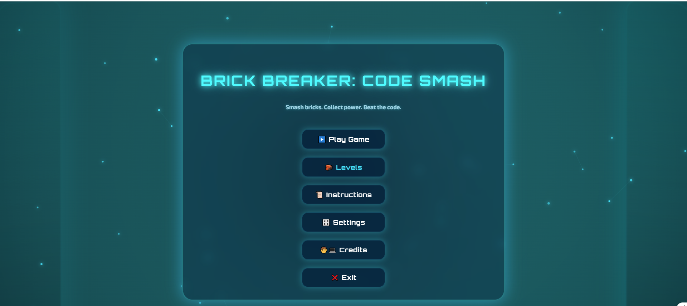
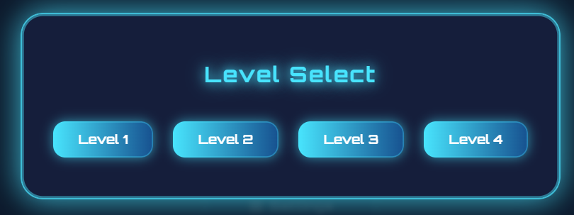
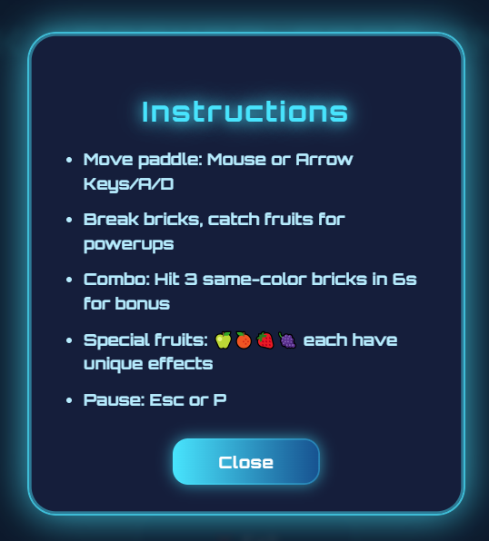
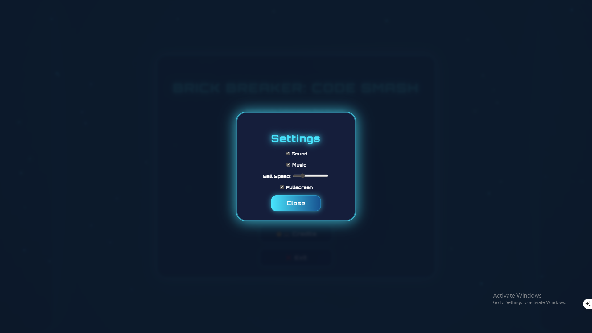

# BRICK BREAKER: CODE SMASH

A cyberpunk, AAA-quality, fully modular Brick Breaker game built with HTML, CSS, and vanilla JavaScript. Featuring a futuristic main menu, dynamic levels, combos, powerups, and a visually stunning UI/UX.

---

## 🚀 Game Overview

**BRICK BREAKER: CODE SMASH** is a feature-rich, modern take on the classic brick breaker genre. It combines:
- A glassmorphic, neon-lit main menu
- Four unique, hand-crafted levels with increasing challenge
- Combos, fruit powerups, and boss mechanics
- Responsive, accessible, and visually immersive design

---

## 🖼️ Screenshots

| Section         | Screenshot Link |
|----------------|----------------|
| Main Menu      |  |
| Levels Modal   |  |
| Instructions   |  |
| Settings       |  |
| Level 1        |  |
| Level 2        |  |
| Level 3        |  |
| Level 4        |  |
| Combo's        |  |
| Fruit Generation |  |

---

## 🎮 Features

- **Cyberpunk Main Menu:** Glassmorphic, neon, animated background, full keyboard and ARIA accessibility.
- **Level Selection:** Instantly jump to any level from the menu.
- **Instructions & Settings:** Beautiful modals for help and configuration (sound, music, ball speed, fullscreen).
- **Four Handcrafted Levels:**
  - Level 1: Classic, wide paddle, gentle intro
  - Level 2: Hollow diamond, faster ball, tighter paddle
  - Level 3: "D & W" shapes, combo mechanics, berry storm
  - Level 4: Chaotic boss, brick regeneration, powerups, final challenge
- **Combos:** Hit 3 same-color bricks in 6s for bonus, ball glow, and border FX.
- **Fruit Generation:** Every brick can drop a fruit; each fruit has unique effects (paddle size, speed, multiball, etc.).
- **Powerups:** Freeze, multiball, paddle stretch, and more (Level 4).
- **Responsive & Accessible:** Works on desktop and mobile, with full keyboard navigation and focus rings.
- **AAA Visuals:** Neon glows, glass panels, animated side elements, and matrix code streams.

---

## 🛠️ How the Game Was Made

This game was built using a series of detailed, AAA-level prompts, each focusing on a different aspect of modern game development:

- **Main Menu:** Designed as a cyberpunk, glassmorphic UI with animated canvas background, neon title, and interactive modals for levels, instructions, settings, and credits. All menu logic is modular and accessible.
- **Levels:** Each level is defined in `levels.js` with unique layouts, brick types, fruit logic, and special mechanics. Level 4 features procedural, mirrored chaos and brick regeneration.
- **Game Loop & Entities:** The game uses a modular, class-based architecture (`GameManager`, `Paddle`, `Ball`, `Brick`, `Fruit`, `Scoreboard`). The game loop is powered by `requestAnimationFrame` for smooth, frame-independent animation.
- **Combos:** A combo system tracks the last 3 brick hits by color and time. Triggering a combo gives bonus points, ball glow, and a border FX.
- **Fruit Generation:** Every brick can drop a fruit, with color-dependent effects. Fruits animate, trail, and trigger powerups when caught.
- **UI/UX Polish:** All overlays, modals, and buttons use glassmorphism, neon glows, and smooth transitions. The scoreboard is fixed and always visible. Side panels feature floating code, fruit, and matrix elements for depth.
- **Accessibility:** All interactive elements are keyboard navigable, with ARIA labels and focus rings.
- **File Structure:** The codebase is organized for modularity and scalability, with clear separation of concerns.

---

## 📁 File Structure

```
/ (root)
├── index.html           # Main menu (cyberpunk UI)
├── game.html            # Game view (canvas, overlays, HUD)
├── style.css            # All styles (main menu, game, modals, side elements)
├── levels.js            # Level definitions and layouts
├── script.js            # Game entry point and logic
├── /classes/            # Modular ES6 classes
│   ├── GameManager.js
│   ├── Paddle.js
│   ├── Ball.js
│   ├── Brick.js
│   ├── Fruit.js
│   ├── Scoreboard.js
├── /js/
│   └── main-menu.js     # Main menu interactivity, modals, audio, transitions
├── /assets/
│   ├── sfx/             # Sound effects (hover, click, music, etc.)
│   ├── music/           # Menu and game music
│   └── images/          # (Optional) Fruit, powerup, or logo images
├── /screenshots/        # Screenshots for README
└── README.md            # This file
```

---

## 🧑‍💻 Tech Stack

- **HTML5**: Semantic, accessible structure for both menu and game.
- **CSS3**: Flexbox, Grid, glassmorphism, neon effects, responsive design, and custom animations.
- **JavaScript (ES6+)**: Modular, class-based architecture, requestAnimationFrame game loop, localStorage for settings.
- **No frameworks or engines**: 100% vanilla JS, CSS, and HTML.

---

## ▶️ Running the Game

1. Clone the repo and open `index.html` in your browser.
2. Use the main menu to play, select levels, or view instructions/settings/credits.
3. The game is fully playable on desktop and mobile.
4. All settings are saved in localStorage.

---

## 🏆 Credits

Game by **Your Name**  
Stack: HTML, CSS, JS  
[GitHub](https://github.com/yourgithub)  
Version 1.0

---

Enjoy smashing bricks and beating the code! 
